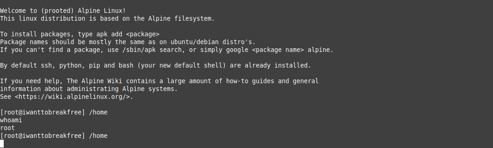

# alpinecraft
Easily turns a (game) server into a general-purpose linux server using proot.

## Why?
This project was made because I wanted to run a game on my cloud-hosted server but couldn't, as I was stuck in some docker environment with limited tools available and no package manager.

## How Does It Work?
Alpinecraft leverages proot, a user-space implementation of chroot, to create **a lightweight Linux environment** within the (game) server. It uses the same underlying technology that lets you run a linux environment in termux. 

This allows you to install and run additional software, turning your game server into a Linux server capable of hosting a variety of applications beyond just what you bought it for.

## To get started, follow these steps:
 1. Stop your server.
 2. Take a look at your server's startup args.
 3. Copy all files to the directory containing the executable for your server.
 4. Replace your server's executable's contents with the contents of copycontents.txt.
 5. (Re)start your server.

## For example:
Let's say your startup args are:
./bin/x64/factorio --port 19410 --server-settings data/server-settings.json --start-server gamesave.zip

The executable is /bin/x64/factorio. You'll need to place the files into /bin/x64.

If done correctly, the directory should contain the following:
- system
- init.sh
- readme.txt
- factorio (<- your executable file)

Next, open the executable file, delete its contents, and paste the contents of the *copycontents.txt* file in it.

At last, restart your server and you'll be greeted with the image above.

## Known limitations
Proot comes with some limitations, as it virtualises a filesystem:
- You will not be able to change any kernel or device setting.
- You can't create device nodes in /dev.
- You can't manipulate namespaces.
- You can't run systemd, but this is largely resolved by using openrc
- Proot may reduce performance

## But..
You're unlikely to run in any of these issues, though. Running another game in your server, setting up tools like SSH, interacting with a python environment, or using your server as a vpn are tested and all work fine.

[more info on proot ->](https://proot-me.github.io/)
